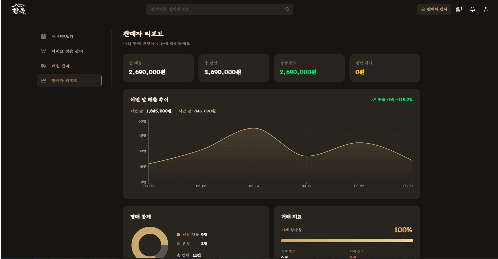

# 🏺 한옥 - 라이브 경매 커머스 플랫폼

  

 

## 💡 프로젝트 소개

**한옥**은 판매자가 실시간 라이브로 상품을 소개하고, 시청자들은 실시간 입찰로 경매에 참여할 수 있는 **라이브 커머스 경매 서비스**입니다.

낙찰부터 에스크로, 결제, 정산, NFT 거래증명서 발행까지 거래의 전 흐름을 하나의 플랫폼에서 안전하게 처리할 수 있도록 설계했습니다.

 

## 📅 프로젝트 기간

<2026.02.16 ~ 2026.03.30>

 

## ✨ 주요 기능

### **실시간 라이브 경매**
- **WebRTC 영상 송출**: LiveKit SFU 서버를 통한 1:N 라이브 스트리밍
- **2가지 경매 방식**: 일반(상향식) / 유일최고가 경매를 시나리오에 맞게 선택
- **실시간 입찰·채팅**: STOMP 브로커로 입찰 결과·시청자 수·채팅을 동기화
- **금칙어 필터**: Aho-Corasick 알고리즘 기반의 채팅 안전 필터

### **안전한 거래 보장**
- **에스크로 시스템**: 낙찰 → 예치금 보관 → 송장 등록 → 구매 확정 → 정산 단계별 관리
- **NFT 거래 증명서**: 구매 확정 시 영수증을 발행하여 블록체인에 영구 기록

### **사용자 경험**
- **실시간 알림**: SSE로 팔로우·에스크로 상태·낙찰·공지를 즉시 푸시
- **판매자 운영 도구**: 프로필·공지·상품 관리, 평점·랭킹·매출 리포트
- **AI 썸네일 생성**: Gemini 이미지 모델로 스트림 썸네일 자동 생성

### **운영 안정성**
- **Blue/Green 무중단 배포**: Jenkins + Nginx upstream 전환으로 다운타임 0
- **통합 관측성**: Prometheus + Loki + Grafana로 메트릭·로그 일원화

 

## 🛠️ 기술 스택

### **Backend**

          

### **Frontend**

       

### **Blockchain**

   

### **Infrastructure & DevOps**

     

### **Monitoring & Testing**

    

### **Communication & Collaboration**

  

 

## 🎯 팀원 소개

|  |  |  |  |  |  |
|------|------|------|------|------|------|
| 신재혁 | 이효은 | 최재각 | 김채윤 |  배재유 | 김강연 |
| Frontend | Frontend | Frontend | Backend | Backend | Backend, Infra | 

 

## 🎯 프로젝트 산출물

- [아키텍처 가이드](./아키텍쳐가이드.md)

 

## 💖 화면 구성

### 메인 페이지
- 라이브 진행, 예정 스트림 카드 리스트
- 카테고리 및 키워드 검색, 신규 판매자 추천 캐러셀
- 시청자 수, 썸네일, 판매자 정보를 한 화면에서 확인

### 라이브 페이지 (시청자 / 판매자)
- **시청자**: 라이브 영상 시청 + 실시간 채팅 및 매크로 채팅 + 실시간 입찰 버튼
- **판매자**: 방송 송출, 상품 라이브 등록, 경매 설명/시작/종료 제어
- 낙찰 시 낙찰자 개인에게 즉시 알림

### 라이브 등록 / 생성 페이지
- 라이브 제목, 카테고리, 예약 시간, 썸네일 등 설정
- 경매 상품 등록(이미지, 시작가, 경매 방식 선택)
- 카테고리별 채팅 매크로 사전 등록

### 판매자 리포트
- 누적 매출, 낙찰 건수, 평점 및 리뷰 수 시각화
- 판매자 랭킹 및 팔로워 추이
  

### 가상머니 페이지
- 현재 잔액 / 출금 가능 금액 표시
- PortOne 결제창을 통한 충전, 등록 계좌로 출금 요청
- 충전 및 출금 내역 타임라인
